## 1. Introducción Histórica: La Naturaleza de la Luz

El estudio de la luz ha sido uno de los debates más fascinantes de la física. En la antigüedad, Euclides aplicó la geometría a la formación de sombras, mientras que en el siglo XI, Al-Hazen describió ya la cámara oscura y las leyes de la reflexión. 

Sin embargo, las teorías científicas modernas no surgieron hasta finales del siglo XVII con dos modelos contrapuestos:

*   **Modelo Corpuscular (Newton):** Postulaba que la luz estaba formada por pequeñas partículas materiales que viajaban a gran velocidad en línea recta.
*   **Modelo Ondulatorio (Huygens):** Defendía que la luz era una onda mecánica que se propagaba a través de un medio ideal llamado éter.

Durante el siglo XIX, el modelo ondulatorio se impuso gracias a los experimentos de **Young** sobre interferencias (1801) y **Fresnel** sobre difracción. Finalmente, **James C. Maxwell** unificó la electricidad y el magnetismo en 1865, demostrando que la luz es una **onda electromagnética** que no necesita medio material para propagarse, predicción que fue confirmada experimentalmente por **Hertz** en 1887.

## 2. La luz como Onda Electromagnética

Como se ha mencionado, Maxwell determinó y Hertz confirmó que la luz es una onda electromagnética. La parte de la física que estudia la luz como una onda se denomina óptica ondulatoria, y utiliza muchos de los desarrollos generales de la teoría de ondas mecánicas, y algunas adaptaciones al caso específico de ondas electromagnéticas. Este enfoque es esencial para comprender fenómenos como la interferencia, la difracción y la polarización, que no pueden ser explicados por el modelo corpuscular.

### 2.1. Naturaleza Electromagnética

Una onda electromagnética consiste en la propagación de campos eléctricos ($\vec{E}$) y magnéticos ($\vec{B}$) oscilantes, en fase y perpendiculares entre sí y a la dirección de propagación. Por tanto, en el caso más sencillo pueden escribirse como:

$$\vec{E}(x, t) = \vec{E}_0 \cos(k x- \omega t)\ \text{ y }\ \vec{B}(x, t) = \vec{B}_0 \cos(k x - \omega t), $$
con $\vec E_0$ y $\vec B_0$ los vectores amplitud de los campos, perpendiculares entre sí y perpendiculares a la dirección de propagación, $k$ el número de onda y $\omega$ la frecuencia angular.

::: {style="text-align:center;"}
{width=50%}
:::

Su velocidad en el vacío es una constante universal, $c=\frac{1}{\sqrt{\mu_0 \epsilon_0}} \approx 3 \cdot 10^8 \text{ m/s}$. 

Cuando una onda electromagnética pasa a un medio material, su velocidad disminuye a una velocidad $v$. Se define el **índice de refracción** de un material $n$ como el cociente entre la velocidad de la onda en el vacío y la velocidad en el medio, es decir, $n = c/v$. El índice de refracción es un número adimensional que caracteriza la capacidad de un material para refractar la luz y será siempre mayor o igual a 1, siendo $n=1$ para el vacío.

:::: {.callout-note title="Ejemplo: índice de refracción del agua" collapse="true" icon="false"}
La velocidad de la luz en el agua es aproximadamente $v = 2.25 \cdot 10^8 \text{ m/s}$. Por lo tanto, el índice de refracción del agua es:
$$n = \frac{c}{v} = \frac{3 \cdot 10^8 \text{ m/s}}{2.25 \cdot 10^8 \text{ m/s}} \approx 1.33.$$
Esto significa que la luz viaja un 33% más lento en el agua que en el vacío, lo que explica fenómenos como la refracción que hace que los objetos sumergidos parezcan más cercanos de lo que realmente están.
:::


::: {.callout-tip title="Tabla: índices de refracción de algunos materiales" collapse="false" icon="false"}

La siguiente tabla muestra valores típicos del índice de refracción para algunos materiales comunes ($\lambda \approx 589$ nm).

| Material        | Índice de refracción (n) |
|--------------|---------------------------|
| Aire (0°C y 1 atm)| 1.000293 |
| Hidrógeno (0°C y 1 atm)| 1.000132 |
| Agua (20°C)    | 1.333 |
| Aceite de oliva (20°C)| 1.47 |
| Hielo          | 1.31 |
| Vidrio         | 1.52 |
| Vidrio Flint   | 1.69 |
| Glicerina      | 1.473 |
| Diamante       | 2.417 |

:::


### 2.2. El Espectro Electromagnético

Las ondas electromagnéticas pueden tener una amplia gama de frecuencias y longitudes de onda, lo que da lugar a diferentes tipos de radiación electromagnética:

*   **Radioondas**: Ondas de baja frecuencia producidas por circuitos eléctricos. Se utilizan principalmente en radiodifusión y telecomunicaciones (radio, TV, telefonía).
*   **Microondas**: Generadas por vibraciones moleculares. Se emplean en radares, comunicaciones y hornos microondas.
*   **Infrarrojos**: Emitidos por cuerpos calientes debido a oscilaciones atómicas. Tienen aplicaciones en calefacción, mandos a distancia y medicina.
*   **Luz visible**: Es la única región del espectro que percibe la retina humana. Es producida por saltos de los electrones más externos del átomo.
*   **Ultravioleta**: Producidos por electrones internos. Tienen aplicaciones en esterilización y medicina, aunque la exposición prolongada es nociva para la piel.
*   **Rayos X**: Ondas de alta energía producidas por electrones próximos al núcleo. Se usan ampliamente en diagnósticos médicos (radiografías) y análisis de materiales.
*   **Rayos gamma**: Son las ondas más energéticas, originadas por procesos nucleares y radiactivos. Poseen un gran poder de penetración y se usan en medicina nuclear.

El **espectro electromagnético** está formado por todas las posibles ondas electromagnéticas, en función de la frecuencia o de la longitud de onda, van desde las ondas de radio de baja frecuencia y gran longitud de onda, aproximadamente de kilómetros, hasta las ondas gamma de alta frecuencia y longitud de onda del orden de picómetros. La luz visible es solo una pequeña fracción de este espectro, comprendida aproximadamente entre los 380 nm (violeta) y los 780 nm (rojo).

::: {style="text-align:center;"}
{width=100%}
:::

### 2.3. Fenómenos Ondulatorios Clave

Como la luz es una onda, exhibe fenómenos característicos de las ondas, que se explican mediante principios fundamentales:

* **Interferencias:** Ocurren cuando dos o más ondas coherentes coinciden en el espacio, sumando sus efectos según el **principio de superposición**. La interferencia puede ser constructiva, si las ondas se suman o destructiva, si las ondas se restan.
* **Difracción:** Es la desviación de la luz al encontrar obstáculos o rendijas de tamaño comparable a su longitud de onda. Se explica mediante el **Principio de Huygens**, donde cada punto de un frente de onda actúa como un nuevo foco emisor.
* **Reflexión y refracción:** Son fenómenos que ocurren cuando la luz cambia de medio. La reflexión ocurre al chocar con una superficie, mientras que la refracción ocurre al pasar de un medio a otro.
*   **Polarización:** Es un fenómeno exclusivo de ondas transversales como la luz. Mediante polarizadores, podemos filtrar la luz para que el campo eléctrico oscile en una única dirección.

### 2.4. Reflexión y Refracción de una onda electromagnética

Cuando una onda incide sobre una superficie, parte de ella se refleja y parte se refracta (o transmite). La **ley de la reflexión** establece que el ángulo de incidencia, respecto a la normal a la superficie, es igual al ángulo de reflexión, también respecto a la normal. Por otro lado, la **ley de la refracción (Snell)** describe cómo cambia la dirección de la onda al pasar de un medio a otro con diferente índice de refracción, y se expresa como:

$$n_1 \text{sen}(\theta_i) = n_2 \text{sen}(\theta_t)$$

donde $n_1$ y $n_2$ son los índices de refracción de los medios, y $\theta_i$ y $\theta_t$ son los ángulos de incidencia y refracción (o transmisión), respectivamente.

::: {style="text-align:center;"}
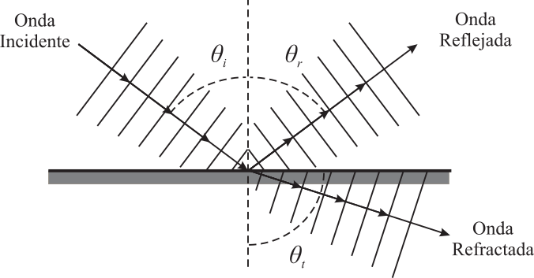{width=50%}
:::

:::: {.callout-tip title="Caso: $n_1<n_2$" collapse="false" icon="false"}
Si el índice de refracción del medio 1 (por el cual se propaga la onda) es menor que el del medio 2 (al cual se va a refractar), entonces la luz se refractará hacia la normal, es decir, el ángulo de refracción será menor que el ángulo de incidencia ($\theta_t < \theta_i$). Esto se puede deducir de la ley de Snell:

$$n_1\, \text{sen}(\theta_i) = n_2\, \text{sen}(\theta_t)\ \Rightarrow\ \text{sen}(\theta_t) = \frac{n_1}{n_2} \text{sen}(\theta_i).$$

Como $n_1 < n_2$, entonces $\text{sen}(\theta_t) < \text{sen}(\theta_i)$, lo que implica que $\theta_t < \theta_i$.

:::{style="text-align:center;"}
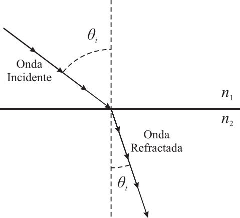{width=40%}
:::

::: {.callout-note title="Ejemplo: Onda incidiendo con un ángulo de 30° desde el aire hacia el agua" collapse="true" icon="false"}
Si la onda pasa del aire al agua, con $n_1 \approx 1$ y $n_2 \approx 1.33$, la luz se doblará hacia la normal al entrar en el agua, lo que explica por qué los objetos sumergidos parecen más cercanos de lo que realmente están.

En concreto, si la luz incide con un ángulo de 30° desde el aire hacia el agua, podemos calcular el ángulo de refracción usando la ley de Snell:
$$ 1 \,\text{sen}(30°) = 1.33 \, \text{sen}(\theta_t)$$
$$\text{sen}(\theta_t) = \frac{\text{sen}(30°)}{1.33} = \frac{0.5}{1.33} \approx 0.3759$$
$$\theta_t = \text{sen}^{-1}(0.3759) \approx 22.09°$$
:::

::::

:::: {.callout-tip title="Caso: $n_1>n_2$" collapse="false" icon="false"}
Si el índice de refracción del medio 1 es mayor que el del medio 2, entonces la luz se refractará alejándose de la normal, es decir, el ángulo de refracción será mayor que el ángulo de incidencia ($\theta_t > \theta_i$). Esto se deduce de la ley de Snell de manera similar al caso anterior:
$$n_1\, \text{sen}(\theta_i) = n_2\, \text{sen}(\theta_t)\ \Rightarrow\ \text{sen}(\theta_t) = \frac{n_1}{n_2} \text{sen}(\theta_i).$$ 
Como $n_1 > n_2$, entonces $\text{sen}(\theta_t) > \text{sen}(\theta_i)$, lo que implica que $\theta_t > \theta_i$.

:::{style="text-align:center;"}
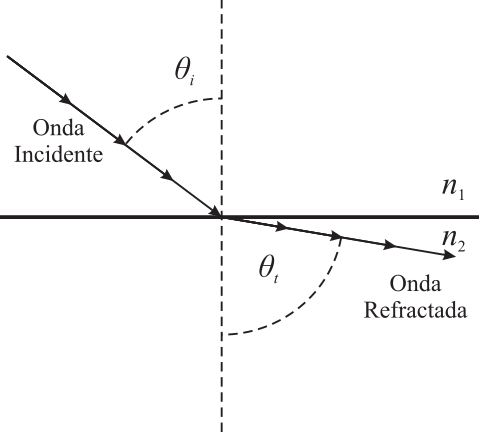{width=40%}
:::

::: {.callout-note title="Ejemplo: Onda incidiendo con un ángulo de 30° desde el agua hacia el aire" collapse="true" icon="false"}
Si la onda pasa del agua al aire, con $n_1 \approx 1.33$ y $n_2 \approx 1$, la luz se doblará alejándose de la normal al salir del agua, lo que explica por qué los objetos sumergidos parecen más cercanos de lo que realmente están.
En concreto, si la luz incide con un ángulo de 30° desde el agua hacia el aire, podemos calcular el ángulo de refracción usando la ley de Snell:
$$1.33\, \text{sen}(30°) = 1\, \text{sen}(\theta_t)$$
$$\text{sen}(\theta_t) = 1.33\, \text{sen}(30°) = 1.33 \times 0.5 = 0.665$$
$$\theta_t = \text{sen}^{-1}(0.665) \approx 41.81°$$
::: 

::::

### 2.5. Reflexión Total Interna
En el caso en el que la onda pasa de un medio con mayor índice de refracción a otro con menor índice de refracción, hemos visto que la onda refractada se acerca a la superficie. Si se inclina la onda incidente, aumentando el ángulo de incidencia, existe un **ángulo límite** o **ángulo crítico**, $\theta_l$, a partir del cual la luz no se refracta, sino que se refleja completamente dentro del primer medio. Este fenómeno se conoce como **reflexión total interna** y se produce cuando el ángulo de incidencia es mayor que el ángulo crítico, que se calcula como:
$$\theta_l = \text{sen}^{-1}\left(\frac{n_2}{n_1}\right)$$


:::: {style="display:flex; justify-content:center; gap:5%;align-items:flex-end;"}

::: {style="text-align:center;"}
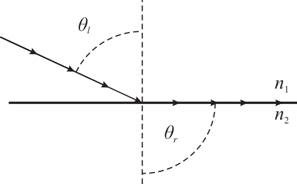{width=100%}

:::

::: {style="text-align:center;"}
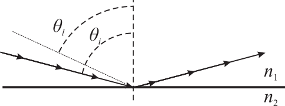{width=100%}
:::

::::

::: {.callout-note title="Ejemplo: Ángulo crítico para la luz que pasa del agua al aire" collapse="true" icon="false"}
Si la luz pasa del agua al aire, con $n_1 \approx 1.33$ y $n_2 \approx 1$, el ángulo crítico se calcula como:
$$\theta_l = \text{sen}^{-1}\left(\frac{1}{1.33}\right) \approx 48.75°$$

Esto significa que si la luz incide desde el agua hacia el aire con un ángulo mayor a 48.75°, se producirá reflexión total interna, y la luz no saldrá del agua, sino que se reflejará completamente dentro de ella.
:::

:::: {.callout-tip title="Aplicación: Fibra óptica" collapse="false" icon="false"}
La fibra óptica es un medio de transmisión de datos que utiliza la reflexión total interna para guiar la luz a través de su núcleo. 

Está compuesta por un núcleo de vidrio o plástico con un índice de refracción $n_1$ alto, rodeado por una capa de revestimiento con un índice de refracción $n_2$ más bajo. Cuando la luz se introduce en el núcleo con un ángulo adecuado, se refleja completamente dentro del núcleo debido a la reflexión total interna, lo que permite que la luz viaje largas distancias sin pérdidas significativas. Este principio es fundamental para el funcionamiento de la fibra óptica, que se utiliza ampliamente en telecomunicaciones, redes de datos y aplicaciones médicas.

> Importante: el ángulo de incidencia en la fibra óptica tiene que ser mayor que el ángulo límite

:::{style="text-align:center;"}
![Esquema de una fibra óptica <small>[IA: Gemini]</small>.](Fibra_optica.png){width=50%}
:::

::::

::: {.callout-tip title="Otras fenómenos físicos y aplicaciones de la reflexión total interna" collapse="true" icon="false"}
Además de la fibra óptica, la reflexión total interna tiene otras aplicaciones importantes en la tecnología y la ciencia, como:

*   **Espejismos:** En la atmósfera, la reflexión total interna puede causar espejismos, donde la luz se refracta y refleja en capas de aire con diferentes temperaturas, creando imágenes distorsionadas de objetos lejanos.
*   **Espejos de agua:** En condiciones atmosféricas específicas, la reflexión total interna puede hacer que objetos lejanos, como barcos o islas, aparezcan flotando en el aire o reflejados en la superficie del agua.
*   **Prismas de reflexión total interna:** Se utilizan en dispositivos ópticos como binoculares y cámaras para redirigir la luz sin pérdidas significativas.
*   **Sensores de nivel:** Se emplean en la industria para detectar el nivel de líquidos, aprovechando la reflexión total interna para determinar si un líquido está presente o no en un recipiente.
*   **Endoscopios:** En medicina, los endoscopios utilizan fibras ópticas para transmitir luz y permitir la visualización de órganos internos sin necesidad de cirugía invasiva.
:::


## 3. Óptica Geométrica: El Modelo de Rayos

Históricamente, el estudio de la luz comenzó analizando su comportamiento macroscópico mucho antes de comprender su naturaleza electromagnética. Así, la **óptica Geométrica** surgió como una disciplina que modela la luz como rayos que se propagan en línea recta, sin considerar su naturaleza ondulatoria. Esta aproximación es válida siempre que la longitud de onda de la luz sea mucho menor que el tamaño de los objetos u orificios con los que interactúa, lo que permite ignorar fenómenos como la interferencia, la difracción o la polarización. Por lo tanto, la óptica geométrica no es una teoría independiente, sino un **caso límite de la óptica ondulatoria** que resulta extremadamente útil para estudiar la propagación de la luz a través de dispositivos complejos sin necesidad de recurrir a la complejidad de las ecuaciones de Maxwell y estudios ondulatorios, que son las que describen el comportamiento de las ondas electromagnéticos.

### 3.1. Del Frente de Onda al Rayo
Desde el punto de vista teórico de la óptica ondulatoria, un **rayo óptico** es una construcción geométrica definida como una línea perpendicular a los frentes de onda, lo que indica la dirección en la que se propaga la energía lumínica. 

En la práctica, modelamos la luz como rayos para simplificar el análisis de su comportamiento en sistemas ópticos, especialmente cuando los objetos y aperturas son mucho mayores que la longitud de onda. Esto nos permite aplicar leyes simples de reflexión y refracción sin tener que resolver las complejas ecuaciones de Maxwell, lo que es fundamental para diseñar y entender dispositivos ópticos como lentes, espejos y sistemas de imagen.

### 3.2. El Principio de Propagación Rectilínea
El postulado fundamental de la óptica geométrica establece que **la luz se propaga en línea recta** mientras el índice de refracción del medio permanezca constante. Los rayos se desvían al cambiar de medio (refracción) o si el índice de refracción del propio medio varía, por ejemplo, por cambios de temperatura en el aire. También se desvían al reflejarse en superficies, como ocurre con los espejos. Sin embargo, en ausencia de estas condiciones, la luz seguirá un camino rectilíneo, lo que es la base para el análisis de sistemas ópticos.

### 3.3. Ejemplos de aplicación de la Óptica Geométrica

Para comprender por qué modelamos la luz como rayos, podemos fijarnos en fenómenos cotidianos que demuestran la propagación rectilínea:

1.  **Formación de Sombras y Penumbras (Eclipses):** 
    Cuando un objeto opaco se interpone ante un foco de luz extenso (como el Sol), la luz viaja en línea recta desde cada punto del emisor. Esto genera una zona de oscuridad total donde no llega ningún rayo (**sombra**) y una zona circundante donde solo llegan rayos de algunas partes del foco (**penumbra**). Este modelo geométrico es el que explica con precisión los eclipses de Sol y Luna.
   
::: {style="text-align:center;"}
![Esquema de eclipses <small>[IA: Gemini]</small>.](Eclipse.png){width=50%}
:::

2.  **La Cámara Oscura:**
    Documentada desde el siglo XI por Al-Hazen, consiste en una caja cerrada con un pequeño orificio en una cara. Debido a que la luz viaja en línea recta y el orificio es pequeño, cada punto de un objeto exterior solo puede enviar un rayo (o un haz muy estrecho) a través del agujero, proyectando una imagen invertida en la pared opuesta. Es el fundamento geométrico de la fotografía.

::: {style="text-align:center;"}
![Esquema de la cámara oscura <small>[IA: Gemini]</small>.](Camara_Oscura.png){width=50%}
:::

3.  **Efectos Ópticos de la Refracción:**
    Seguramente has observado que un lápiz parece "doblarse" al introducirlo en un vaso con agua. Este fenómeno se explica por la refracción, que es el cambio de dirección de los rayos al pasar de un medio a otro con diferente índice de refracción. La luz viaja en línea recta dentro de cada medio, pero al cambiar de medio, su dirección se modifica según la ley de Snell, lo que da lugar a la ilusión óptica.

::: {style="text-align:center;"}
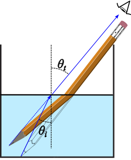{width=30%}
:::

## 3.4. Leyes Fundamentales de la Óptica Geométrica

La observación de los rayos de luz y su comportamiento al pasar de unos medios a otros dio lugar a las leyes de la óptica geométrica. Si el rayo de luz incide sobre una superficie, parte del rayo se refleja y parte se refracta. Si $\theta_i$ es el ángulo de incidencia que forma el rayo que incide en la superficie de separación entre dos medios con la normal, $\theta_r$ y $\theta_t$ son los ángulos de los rayos reflejado y refractado (o transmitido) con la misma normal, entonces las leyes que rigen estos fenómenos son:

1.  **Ley de la Reflexión:** El ángulo de incidencia y el de reflexión son iguales ($\theta_i = \theta_{r}$).
2.  **Ley de la Refracción (Snell):** Cuando la luz pasa de un medio 1 a un medio 2, se cumple:
    $$n_1 \text{sen}(\theta_1) = n_2 \text{sen}(\theta_2)$$
    Donde $n$ es el índice de refracción ($n = c/v$).

> **Recuerda:** Si $n_1 > n_2$, existe un **ángulo límite** por encima del cual se produce la **reflexión total**, fundamento de la fibra óptica.

## 4. Sistema óptico y su representación
Un sistema óptico es un conjunto de elementos (lentes, espejos, prismas, etc.) que interactúan con la luz para formar imágenes. Para analizar estos sistemas, utilizamos diagramas de rayos, que son representaciones gráficas que muestran cómo los rayos de luz se propagan a través del sistema. En estos diagramas, se representan los rayos incidentes, reflejados y refractados, lo que nos permite determinar la posición, tamaño y orientación de las imágenes formadas por el sistema óptico.

### 4.1. Elementos de un sistema óptico
Los elementos más comunes en un sistema óptico son:

*   **Lentes:** Dispositivos transparentes que refractan la luz para convergerla o divergerla. Las lentes pueden ser convergentes (convexas) o divergentes (cóncavas).
*   **Espejos:** Superficies reflectantes que pueden ser planas o curvas, cóncavas o convexas, que reflejan la luz que incide sobre ellas.
*   **Prismas:** Dispositivos que refractan la luz para dispersarla en sus componentes espectrales y/o para cambiar su dirección. En la actualidad los prismas se utilizan principalmente para cambiar la dirección de la luz, mientras que la dispersión de la luz se realiza principalmente mediante **redes de difracción**.
*   **Pantallas:** Superficies donde se proyectan las imágenes formadas por los sistemas ópticos.

Los sistemas ópticos más habituales son sistemas ópticos de **revolución**, que son aquellos que tienen simetría de circular alrededor de un **eje óptico**, lo que simplifica su análisis y diseño. El eje óptico es una línea imaginaria que pasa por el centro de un sistema óptico y es perpendicular a las superficies de los elementos ópticos. El **vértice** o **vértice** es el punto en el eje óptico donde se encuentra el sistema óptico, y es el punto de referencia para medir las distancias de objetos e imágenes. 

Por ejemplo, para una lente o un espejo curvo, el eje óptico sería la línea que pasa por el centro de la lente o el espejo y es perpendicular a su superficie, mientras que el vértice sería el punto donde el eje óptico intersecta la lente o el espejo.

### 4.2. Objetos e Imágenes
En óptica, un **objeto** es cualquier fuente de luz o cualquier cosa que refleje la luz, de forma que de todos los puntos del objeto se emiten rayos de luz. Los puntos del objeto se llama **puntos objeto ($O$)**. Una **imagen** es la representación visual de un objeto formada por un sistema óptico, y los puntos de la imagen se llaman **puntos imagen ($O^\prime$)**. Las imágenes pueden ser:

*   **Reales:** Se forman por la convergencia de rayos de luz, tras haber pasado por el sistema óptico, y se pueden proyectarse en una pantalla. En este caso los rayos salen del sistema óptico convergiendo, y se cruzan realmente.
*   **Virtuales:** Se forman por la apariencia divergencia de rayos de luz y no pueden proyectarse en una pantalla, ya que los rayos no se cruzan realmente. En este caso, los rayos parecen divergir desde un punto detrás del sistema óptico, de ahí el nombre de imagen virtual. 

:::: {style="display:flex; justify-content:center; gap:5%;align-items:flex-center;"}

::: {style="text-align:center;"}
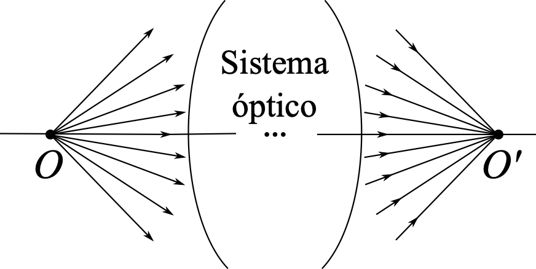{width=100%}

:::

::: {style="text-align:center;"}
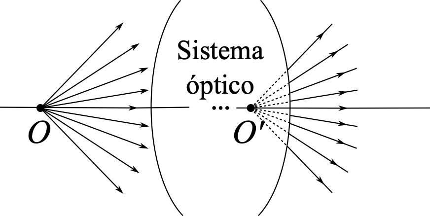{width=100%}
:::

::::

Las imágenes también pueden ser **derechas** o **invertidas**, dependiendo de la orientación de la imagen con respecto al objeto, de forma que si la imagen tiene la misma orientación que el objeto, se dice que es derecha, y si tiene orientación opuesta, se dice que es invertida. 

Por último, el tamaño de la imagen puede ser mayor, menor o igual al del objeto, lo que se describe mediante el **aumento lateral**, que es la razón de la altura de la imagen a la altura del objeto. Si el aumento lateral es mayor que 1, la imagen es mayor que el objeto, si es menor que 1, la imagen es menor que el objeto, y si es igual a 1, la imagen tiene el mismo tamaño que el objeto. Si el aumento lateral es positivo, la imagen es derecha, y si es negativo, la imagen es invertida.

::: {style="text-align:center;"}
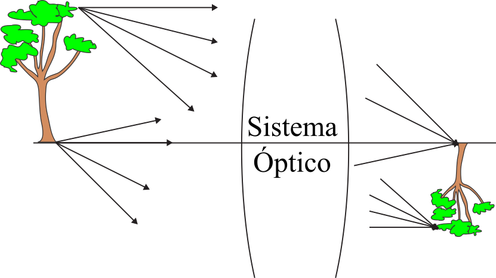{width=80%}
:::

### 4.3. Focos objetos e imagen
En sistemas ópticos, el **foco objeto ($F$)** es el punto objeto sobre el eje óptico donde los rayos que inciden en el sistema óptico salen paralelos tras pasar por él.

El **foco imagen ($F'$)** es el punto imagen sobre el eje óptico donde los rayos que inciden paralelos al eje óptico convergen o parecen divergir después de pasar por el sistema. Estos puntos son fundamentales para determinar la formación de imágenes y se utilizan como referencia para aplicar las leyes de la óptica geométrica.

:::: {style="display:flex; justify-content:center; gap:5%;align-items:flex-center;"}

::: {style="text-align:center;"}
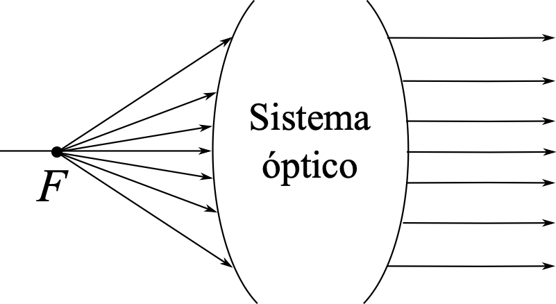{width=100%}

:::

::: {style="text-align:center;"}
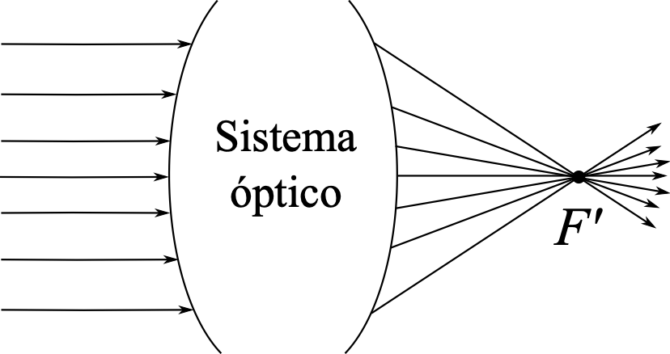{width=100%}
:::

::::

### 4.4. Distancias y alturas
En óptica, es fundamental medir las distancias y alturas de los objetos e imágenes para analizar su formación. La **distancia objeto ($s$)** es la distancia desde el objeto al vértice, mientras que la **distancia imagen ($s'$)** es la distancia desde la imagen al vértice. La **altura del objeto ($y$)** es la distancia vertical desde el objeto al eje óptico, y la **altura de la imagen ($y'$)** es la distancia vertical desde la imagen al eje óptico. Estas medidas son esenciales para aplicar las fórmulas de la óptica geométrica y determinar las características de las imágenes formadas por los sistemas ópticos.

La **distancia focal objeto ($f$)** es la distancia desde el vértice al foco objeto ($F$), mientras que la **distancia focal imagen ($f'$)** es la distancia desde el vértice al foco imagen ($F'$). 

::: {style="text-align:center;"}
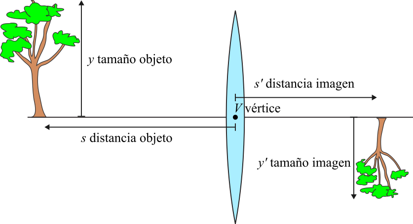{width=80%  fig-alt="Distancias y tamaños, objeto e imagen." .lightbox #fig-distancias}
:::

### 4.5. Trazado de rayos
El análisis de la formación de imágenes de un sistema óptico se puede hacer de forma gráfica, mediante lo que se conoce como **trazado de rayos**. Este trazado se apoya en tres rayos principales que facilitan la construcción de diagramas de rayos:

1.  **Rayo paralelo:** Incide paralelo al eje óptico y, después de pasar por el sistema óptico, se refracta o refleja de tal manera que pasa, real o virtualmente, por el foco imagen ($F'$).
2.  **Rayo focal:** Pasa por el foco objeto ($F$) y, después de pasar por el sistema óptico, se refracta o refleja de tal manera que sale paralelo al eje óptico.
3.  **Rayo central:** Es un rayo que no se desvía al pasar por el sistema óptico,es decir, sigue una trayectoria recta a través del sistema óptico. En el caso de las lentes, el rayo central pasa por el vértice de la lente, mientras que en el caso de los espejos, el rayo central pasa por el centro de curvatura del espejo.

Estos rayos son fundamentales para determinar la posición, tamaño y orientación de las imágenes formadas por los sistemas ópticos, y se utilizan como referencia para aplicar las leyes de la óptica geométrica.


::: {style="text-align:center;"}
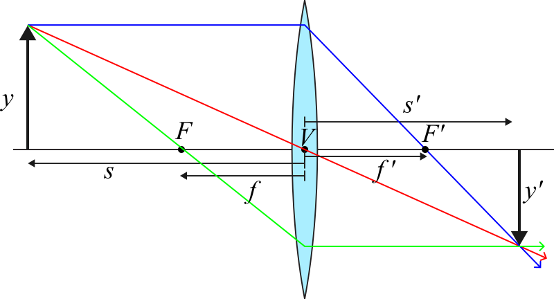{width=80% .lightbox #fig-lente-delgada}
:::


## 5. Criterio de Signos

El criterio de signos más utilizado en óptica es el **criterio DIN**, que es un sistema de coordenadas cartesiano centrado en el vértice ($V$). Concretamente, el criterio de signos DIN establece lo siguiente:

*   La lente o el espejo son verticales y el eje óptico es horizontal.
*   El vértice ($V$) de la superficie es el origen $(0,0)$.
*   Las distancias de objetos e imágenes ($s$ y $s'$) a la izquierda son negativas y a la derecha son positivas.
*   Las alturas de los objetos e imágenes ($y$ y $y'$) por debajo del eje son negativas y por encima del eje son positivas.

:::{.callout-note title="Ejemplo: aplicación del criterio de signos en @fig-distancias" collapse="true" icon="false"}
En @fig-distancias, el objeto se encuentra a la izquierda del vértice, por lo que su distancia objeto ($s$) es negativa. La imagen se forma a la derecha del vértice, por lo que su distancia imagen ($s'$) es positiva. Además, el objeto está por encima del eje óptico, por lo que su altura ($y$) es positiva, mientras que la imagen está por debajo del eje óptico, por lo que su altura ($y'$) es negativa. En resumen, en este caso, $s < 0$, $s' > 0$, $y > 0$ y $y' < 0$ según el criterio de signos DIN.
:::

## 6. Lentes Delgadas

Las lentes son el componente principal de instrumentos como el microscopio o el telescopio.  Consisten en un medio transparente con dos superficies esféricas, que pueden ser convexas o cóncavas. Las lentes se clasifican en:

*   **Lentes convergentes:** Son más anchas en el centro que en los bordes, y esta forma produce que los rayos paralelos al eje óptico que inciden sobre la lente salgan de ella convergiendo hacia el foco imagen, que por tanto será real. Las lentes convergentes se representan con una una doble flecha que apunta hacia afuera, indicando que la luz se refracta hacia el eje óptico.

::: {style="text-align:center;"}
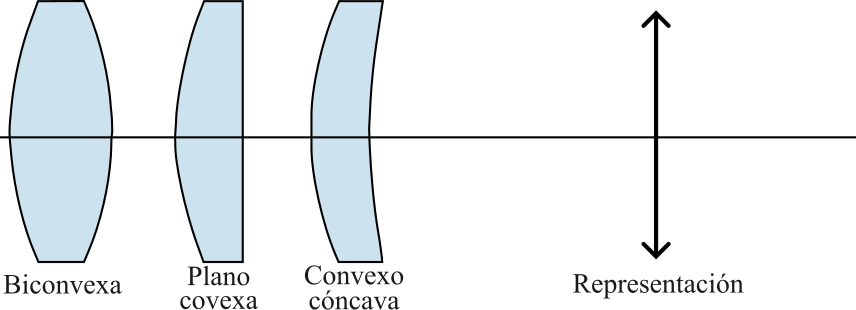{width=80%}
:::
Las lentes convergentes se utilizan en una amplia variedad de aplicaciones, como en gafas para corregir la hipermetropía, en cámaras fotográficas para enfocar la luz y en instrumentos ópticos como microscopios y telescopios para ampliar la imagen de objetos lejanos o pequeños.

*   **Lentes divergentes:** Son más anchas en los bordes que en el centro, lo que produce los rayos paralelos al eje óptico que entren en la lente salgan divergiendo, por lo que el foco imagen será virtual. Las lentes divergentes se representan con una doble flecha que apunta hacia adentro, indicando que la luz se refracta alejándose del eje óptico.

::: {style="text-align:center;"}
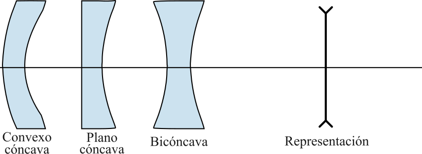{width=80%}
:::

Las lentes divergentes se utilizan principalmente para corregir la miopía, ya que ayudan a divergir los rayos de luz antes de que entren en el ojo, permitiendo que la imagen se forme correctamente en la retina. También se emplean en algunos tipos de cámaras y dispositivos ópticos para controlar la dispersión de la luz.

:::: {style="display:flex; justify-content:center; gap:5%;align-items:flex-center;"}

::: {style="text-align:center;"}
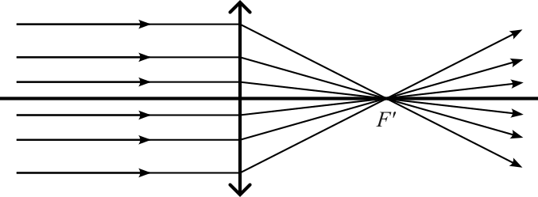{width=100%}

:::

::: {style="text-align:center;"}
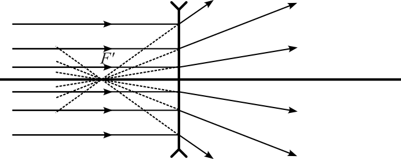{width=100%}
:::

::::


### 6.1. Ecuación de Gauss para lentes delgadas

La ecuación que relaciona la distancia objeto ($s$), la distancia imagen ($s'$) y la distancia focal imagen ($f'$) de una lente delgada es conocida como la **ecuación de Gauss** para lentes delgadas. Esta ecuación se deriva a partir de las leyes de la óptica geométrica y se expresa como:
$$\frac{1}{s'} - \frac{1}{s} = \frac{1}{f'}$$

donde $s$ es la distancia desde el objeto al vértice de la lente, $s'$ es la distancia desde la imagen al vértice de la lente, y $f'$ es la distancia focal imagen de la lente. Esta ecuación es fundamental para analizar y diseñar sistemas ópticos que utilizan lentes delgadas, ya que permite determinar la posición y características de las imágenes formadas por estas lentes.

::: {.callout-note title="Ejemplo: Posición de una imagen" collapse="true" icon="false"}
Si conocemos la distancia objeto ($s$) y la distancia focal imagen ($f'$) de una lente delgada, podemos calcular la distancia imagen ($s'$) utilizando la ecuación de Gauss. Por ejemplo, si un objeto se encuentra a 30 cm de una lente delgada con una distancia focal de 10 cm, podemos calcular $s'$ de la siguiente manera:
$$\frac{1}{s'} - \frac{1}{30} = \frac{1}{10}$$
$$\frac{1}{s'} = \frac{1}{10} + \frac{1}{30} = \frac{3}{30} + \frac{1}{30} = \frac{4}{30}$$
$$s' = \frac{30}{4} = 7.5 \text{ cm}$$
:::

:::: {.callout-tip title="Focos objeto e imagen de una lente delgada" collapse="false" icon="false"} 
A partir de la ecuación de Gauss, se pueden determinar las posiciones de los focos objeto e imagen de una lente delgada. La posición del foco imagen ($F'$) se obtiene haciendo $s=\infty$, lo que significa que el foco imagen se encuentra a una distancia igual a la distancia focal imagen ($f'$) desde el vértice, es decir, $s' = f'$, como era de esperar.

Por otro lado, el foco objeto ($F$) se obtiene haciendo $s'=\infty$, lo que significa que el foco objeto se encuentra a una distancia igual a la distancia focal objeto ($f$) desde el vértice, y se puede calcular utilizando la relación entre las distancias focales objeto e imagen:
$$\frac{1}{f} + \frac{1}{f'} = 0$$
De esta manera, si conocemos la distancia focal imagen ($f'$) de una lente delgada, podemos calcular la distancia focal objeto ($f$) utilizando la fórmula:
$$f = -f'$$
Esto significa que el foco objeto se encuentra a la misma distancia que el foco imagen, pero en el lado opuesto del vértice, lo que es una característica fundamental de las lentes delgadas.
::::

### 6.2 Relación de tamaños
La relación entre el tamaño de la imagen $y\prime$ y el tamaño del objeto $y$ se calcula utilizando la siguiente fórmula:
$$\frac{y'}{y} = \frac{s'}{s}$$
donde $s'$ es la distancia imagen y $s$ es la distancia objeto.

#### Aumento Lateral ($\beta$)

La relación entre el tamaño imagen y el tamaños objeto se conoce como el **aumento lateral** ($\beta$), y es una medida de cuánto más grande o más pequeña es la imagen en comparación con el objeto. Es decir, el aumento lateral se define como la razón entre el tamaño de la imagen y el tamaño del objeto, y se calcula utilizando la siguiente fórmula:
$$\beta = \frac{y'}{y} = \frac{s'}{s}$$
*   Si $\beta > 0$, la imagen es **derecha**.
*   Si $\beta < 0$, la imagen es **invertida**.

:::{.callout-note title="Ejemplo: Cálculo del aumento lateral" collapse="true" icon="false"}
Si se conoce la posición y el tamaño de un objeto, y se quiere obtener el tamaño de la imagen formada por una lente delgada de focal imagen ($f'$), se puede calcular el aumento lateral ($\beta$), primero es necesario obtener la distancia imagen ($s'$) utilzando la ecuación de Gauss. Luego, se utiliza la expresión de $\beta$ para obtener el aumento lateral. A partir del tamaño del objeto se puede obtener con $\beta$ el tamañao de la imagen.

Por ejemplo, si un objeto de 5 cm de altura se encuentra a 30 cm de una lente delgada con una distancia focal de 10 cm, hemos calculado previamente que la distancia imagen ($s'$) es de 7.5 cm, entonces el aumento lateral se calcula como:
$$\beta = \frac{s'}{s} = \frac{7.5}{30} = 0.25$$
Esto significa que la imagen es un cuarto del tamaño del objeto, es decir, la imagen es más pequeña que el objeto. Además, como $\beta$ es positivo, la imagen es derecha, lo que indica que tiene la misma orientación que el objeto. El tamaño de la imagen se puede calcular multiplicando el tamaño del objeto por el aumento lateral:
$$y' = \beta \cdot y = 0.25 \cdot 5 \text{ cm} = 1.25 \text{ cm}$$
Por lo tanto, la imagen formada por la lente delgada tiene una altura de 1.25 cm, es derecha y más pequeña que el objeto original.
:::

### 6.3 Marcha de rayos

La marcha de rayos descrita anteriomente y mostrada en @fig-lente-delgada permite obtener graficamente la posición de las imágenes. Para ello necesita la posición de los focos objetos e imagen de la lente.

:::: {.callout-tip title="Marcha de rayos de una lente convergente" collapse="false" icon="false"} 
::: {style="text-align:center;"}
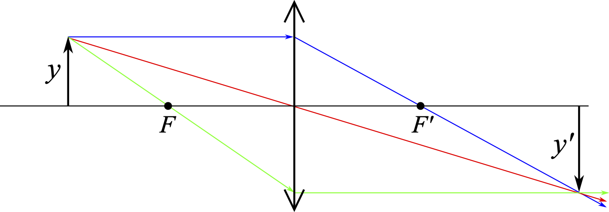{width=80%}

:::
::::

:::: {.callout-tip title="Marcha de rayos de una lente divergente" collapse="false" icon="false"} 
::: {style="text-align:center;"}
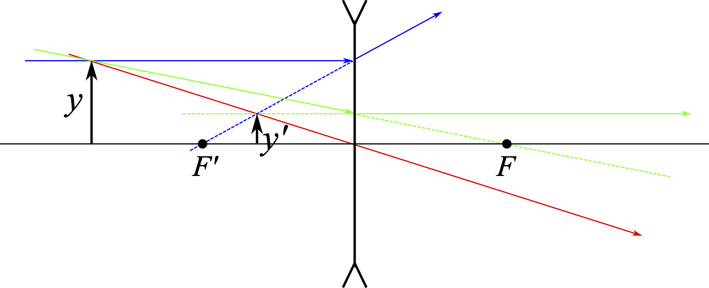{width=80%}

:::
::::

## 7. Espejos Esféricos

Un espejo es un sistema donde la luz cambia de sentido tras la reflexión. Existe dos tipos de espejos esféricos:

*   **Espejo Cóncavo:** La parte reflectante está curvada hacia el objeto. Puede formar imágenes reales o virtuales según la posición del objeto.
*   **Espejo Convexo:** La parte reflectante está curvada hacia fuera. Siempre forma imágenes virtuales, derechas y de menor tamaño.

El radio de curvatura ($R$) es la posición del centro de curvatura mediad desde el vertice, que es el origen del sistema de referencia. Por esto, para un espejo cóncavo, el radio de curvatura es positivo, mientras que para un espejo convexo, el radio de curvatura es negativo.

### 7.1. Ecuación del espejo esférico

Para un espejo esférico de radio $R$, la relación entre la posición del objeto ($s$) y la de la imagen ($s'$) viene dada por:

$$\frac{1}{s'} + \frac{1}{s} = \frac{2}{R}$$

::: {.callout-tip title="Focos de un espejo esférico" collapse="false" icon="false"} 

De la expresión del espejo esférico se puede obtener distancia focal imagen y objeto.

Para obtener la distancia focal imagen ($f'$) se hace $s=\infty$, lo que significa que el foco imagen se encuentra a una distancia igual a la mitad del radio de curvatura ($R/2$) desde el vértice, es decir, $f' = R/2$.

Para obtener la distancia focal objeto ($f$) se hace $s'=\infty$, lo que significa que el foco objeto se encuentra a una distancia igual a la mitad del radio de curvatura ($R/2$) desde el vértice, es decir, $f = R/2$.

Por tanto, para una espejo esférico, el foco objeto e imagen se encuentran en el mismo punto, a una distancia de $R/2$ del vértice, aunque en lados opuestos del vértice.

La ecuación del espejo esférico se puede reescribir como:
$$\frac{1}{s'} + \frac{1}{s} = \frac{1}{f'}$$

:::: {style="display:flex; justify-content:center; gap:5%;align-items:flex-center;"}

::: {style="text-align:center;"}
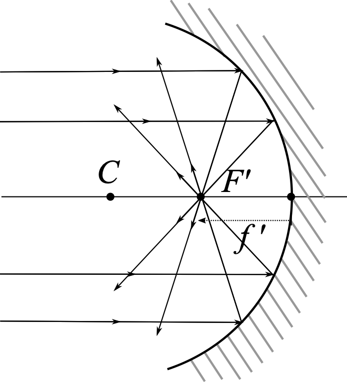{width=60%}

:::

::: {style="text-align:center;"}
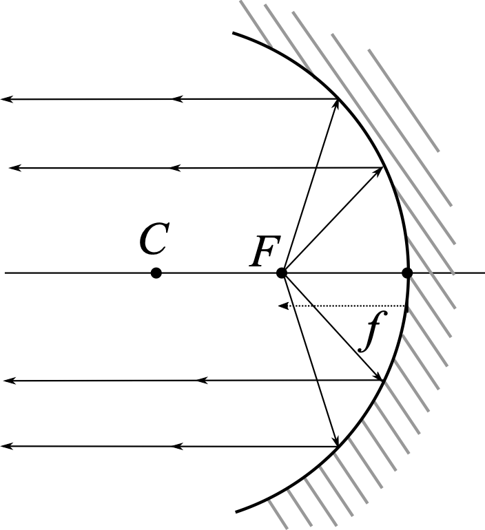{width=60%}
:::

::::

:::

::: {.callout-note title="Ejemplo: Posición de una imagen en un espejo esférico" collapse="true" icon="false"}

Si un objeto se encuentra a 10 cm de un espejo cóncavo con un radio de curvatura de 40 cm, podemos calcular la posición de la imagen utilizando la ecuación del espejo esférico. 

El objeto se encuentra a la izquierda del vértice, por lo que su distancia objeto ($s$) es de -10 cm. El radio de curvatura es positivo para un espejo cóncavo, por lo que $R = -40$ cm. Sustituyendo estos valores en la ecuación del espejo esférico, tenemos:

$$\frac{1}{s'} - \frac{1}{10} = \frac{2}{-40}$$
$$\frac{1}{s'} = -\frac{1}{20} - \frac{1}{10} = -\frac{3}{20}$$
$$s' = -\frac{20}{3} \text{ cm}=-6.67 \text{ cm}$$

Es decir, la imagen se forma a 6.67 cm del vértice, pero en el lado del objeto, lo que indica que la imagen es real. 

:::

### 7.2. Relación de tamaños en espejos esféricos
La relación entre el tamaño de la imagen $y\prime$ y el tamaño del objeto $y$ en un espejo esférico se calcula utilizando la siguiente fórmula:
$$\frac{y'}{y} = -\frac{s'}{s}$$
donde $s'$ es la distancia imagen y $s$ es la distancia objeto. El signo negativo en la fórmula indica que si la imagen es real (es decir, si $s'$ es negativo), entonces la imagen será invertida con respecto al objeto, lo que se refleja en el aumento lateral ($\beta$) de la imagen, que en este caso crea:
$$\beta = -\frac{s'}{s}$$
*   Si $\beta > 0$, la imagen es **derecha**.
*   Si $\beta < 0$, la imagen es **invertida**.

::: {.callout-note title="Ejemplo: Cálculo del aumento lateral en un espejo esférico" collapse="true" icon="false"}
Si se conoce la posición y el tamaño de un objeto, y se quiere obtener el tamaño de la imagen formada por un espejo esférico de radio de curvatura ($R$), se puede calcular el aumento lateral ($\beta$), primero es necesario obtener la distancia imagen ($s'$) utilizando la ecuación del espejo esférico. Luego, se utiliza la expresión de $\beta$ para obtener el aumento lateral. A partir del tamaño del objeto se puede obtener con $\beta$ el tamaño de la imagen.

Por ejemplo, si un objeto de 5 cm de altura se encuentra a 10 cm de un espejo cóncavo con un radio de curvatura de 40 cm, hemos calculado previamente que la distancia imagen ($s'$) es de -6.67 cm, entonces el aumento lateral se calcula como:
$$\beta = -\frac{s'}{s} = -\frac{-6.67}{-10} = 0.667$$
Esto significa que la imagen es aproximadamente dos tercios del tamaño del objeto, es decir, la imagen es más pequeña que el objeto. Además, como $\beta$ es positivo, la imagen es derecha, lo que indica que tiene la misma orientación que el objeto. El tamaño de la imagen se puede calcular multiplicando el tamaño del objeto por el aumento lateral:
$$y' = \beta \cdot y = 0.667 \cdot 5 \text{ cm} = 3.33 \text{ cm}$$
Por lo tanto, la imagen formada por el espejo cóncavo tiene una altura de 3.33 cm, es derecha y más pequeña que el objeto original.
:::

### 7.3. Marcha de rayos en espejos esféricos
La marcha de rayos para espejos esféricos se basa en los mismos principios que para las lentes delgadas, pero con algunas diferencias debido a la naturaleza de la reflexión en lugar de la refracción. 

Para un espejo cóncavo, los focos objetos e imagen son reales. Los rayos paralelos al eje óptico se reflejan convergiendo hacia el foco imagen ($F'$), los rayos que pasan por el foco objeto ($F$) se reflejan saliendo paralelos al eje óptico y los rayos que pasan por el centro de curvatura se reflejan sobre sí mismos. La imagen se forma en la intersección de estos rayos reflejados, y puede ser real o virtual dependiendo de si la posición del objeto es antes del foco (imagen virtual) o después del foco (imagen real).

Para un espejo convexo, los rayos paralelos al eje óptico se reflejan divergiendo, de forma que es la continuación del rayo reflejado la que pasa por el foco imagen ($F$); los rayos que inciden hacia el foco objeto ($F$) se reflejan saliendo paralelos al eje óptico; y los rayos que inciden hacia el centro de curvatura se reflejan sobre sí mismos. La imagen se forma en la intersección de las continuaciones de los rayos reflejados. En este caso, la imagen siempre es virtual, derecha y de menor tamaño que el objeto.

:::: {style="display:flex; justify-content:center; gap:5%;align-items:flex-center;"}

::: {style="text-align:center;"}
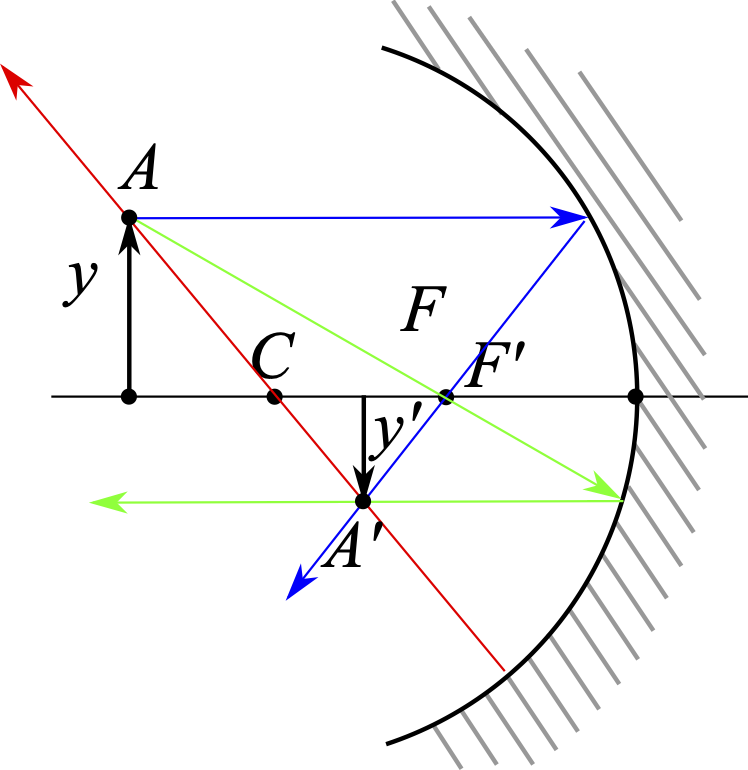{width=40%}

:::

::: {style="text-align:center;"}
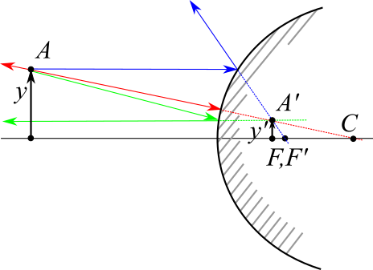{width=90%}
:::

::::

## 8. El Ojo Humano y sus Defectos

El ojo funciona como un sistema de lentes convergentes que proyecta imágenes en la retina. Como repaso para Física II, debes recordar cómo se corrigen las ametropías:

*   **Miopía:** El ojo es demasiado potente y la imagen se forma antes de la retina. Se corrige con **lentes divergentes**.
*   **Hipermetropía:** La imagen se formaría detrás de la retina. Se corrige con **lentes convergentes**.
*   **Astigmatismo:** La córnea tiene una forma irregular, lo que provoca que la imagen se forme en diferentes planos. Se corrige con **lentes cilíndricas**.
*   **Presbicia:** El cristalino pierde flexibilidad con la edad, lo que dificulta enfocar objetos cercanos. Se corrige con **lentes convergentes** para visión cercana.

```quizdown

# ¿Qué modelo de la luz postulaba que esta estaba formada por pequeñas partículas materiales?
- [ ] Modelo Ondulatorio de Huygens.
- [x] Modelo Corpuscular de Newton.
- [ ] Modelo Electromagnético de Maxwell.

# ¿Quién demostró teóricamente en 1865 que la luz es una onda electromagnética?
- [ ] Heinrich Hertz.
- [x] James C. Maxwell.
- [ ] Thomas Young.

# ¿Qué campos oscilan en una onda electromagnética y cómo lo hacen?
- [ ] Campos eléctricos y magnéticos paralelos entre sí.
- [x] Campos eléctricos y magnéticos perpendiculares entre sí y a la dirección de propagación.
- [ ] Solo campos eléctricos en la dirección del movimiento.

# La velocidad de la luz en el vacío es aproximadamente:
- [x] $3 \cdot 10^8\ \text{m/s}$
- [ ] $2.25 \cdot 10^8\ \text{m/s}$
- [ ] $340\ \text{m/s}$

# El índice de refracción ($n$) de un material se define como:
- [ ] El producto de la velocidad en el vacío y en el medio.
- [x] El cociente entre la velocidad en el vacío ($c$) y la velocidad en el medio ($v$).
- [ ] La diferencia de velocidades entre dos medios.

# ¿Cuál es el valor mínimo que puede tomar el índice de refracción?
- [ ] 0.
- [ ] 0.5.
- [x] 1 (para el vacío).

# ¿En qué rango de longitudes de onda se encuentra la luz visible?
- [ ] Entre 100 nm y 400 nm.
- [x] Entre 380 nm y 780 nm.
- [ ] Entre 1 mm y 1 m.

# ¿Qué tipo de ondas electromagnéticas son las más energéticas y tienen gran poder de penetración?
- [ ] Radioondas.
- [ ] Rayos X.
- [x] Rayos gamma.

# ¿Qué fenómeno ocurre cuando dos o más ondas coherentes se suman en el espacio?
- [ ] Difracción.
- [x] Interferencias.
- [ ] Polarización.

# El principio que explica que cada punto de un frente de onda actúa como un nuevo foco emisor es el:
- [x] Principio de Huygens.
- [ ] Principio de Newton.
- [ ] Principio de Fermat.

# ¿Qué fenómeno es exclusivo de las ondas transversales como la luz?
- [ ] Refracción.
- [ ] Difracción.
- [x] Polarización.

# Según la ley de la reflexión, el ángulo de incidencia es:
- [ ] El doble que el de reflexión.
- [x] Igual al ángulo de reflexión.
- [ ] Complementario al de reflexión.

# ¿Cómo se conoce a la ley que describe el cambio de dirección de la luz al pasar de un medio a otro?
- [ ] Ley de Hertz.
- [ ] Ley de Maxwell.
- [x] Ley de Snell.

# Si la luz pasa del aire ($n \approx 1$) al agua ($n \approx 1.33$), el rayo refractado:
- [ ] Se aleja de la normal.
- [x] Se acerca a la normal.
- [ ] No cambia de dirección.

# ¿Qué condición es necesaria para que ocurra la reflexión total interna?
- [ ] Que la luz pase de un medio de menor índice a uno de mayor índice.
- [x] Que la luz pase de un medio de mayor índice a uno de menor índice.
- [ ] Que el ángulo de incidencia sea menor que el ángulo crítico.

# ¿Cuál es la fórmula para calcular el ángulo crítico ($\theta_l$)?
- [x] $\theta_l = \sin^{-1}(n_2 / n_1)$
- [ ] $\theta_l = \cos(n_1 / n_2)$
- [ ] $\theta_l = n_1 \cdot \sin(\theta_i)$

# ¿Cuál es la aplicación tecnológica más importante de la reflexión total interna?
- [ ] El telescopio.
- [x] La fibra óptica.
- [ ] La cámara oscura.

# La óptica geométrica es válida siempre que:
- [ ] La longitud de onda sea mucho mayor que los objetos.
- [x] La longitud de onda sea mucho menor que el tamaño de los objetos.
- [ ] La luz viaje a través del vacío únicamente.

# En óptica geométrica, un rayo se define como:
- [ ] Una partícula de luz.
- [x] Una línea perpendicular a los frentes de onda.
- [ ] Una onda transversal circular.

# ¿Qué postulado establece que la luz viaja en línea recta si el medio es constante?
- [x] Propagación rectilínea de la luz.
- [ ] Ley de Snell.
- [ ] Principio de superposición.

# La zona donde solo llegan rayos de algunas partes de un foco extenso se llama:
- [ ] Sombra.
- [ ] Umbra.
- [x] Penumbra.

# ¿Qué tipo de imagen se puede proyectar en una pantalla porque los rayos realmente se cruzan?
- [ ] Imagen virtual.
- [x] Imagen real.
- [ ] Imagen invertida.

# El punto donde convergen los rayos que inciden paralelos al eje óptico es el:
- [ ] Foco objeto ($F$).
- [x] Foco imagen ($F'$).
- [ ] Vértice ($V$).

# Según el criterio de signos DIN, las distancias a la izquierda del vértice son:
- [ ] Positivas.
- [x] Negativas.
- [ ] Nulas.

# En el trazado de rayos, el "rayo focal" es aquel que:
- [x] Pasa por el foco objeto y sale paralelo al eje óptico.
- [ ] Pasa por el foco imagen y no se desvía.
- [ ] Incide paralelo al eje óptico.

# La ecuación de Gauss para lentes delgadas es:
- [ ] $1/s' + 1/s = 1/f'$
- [x] $1/s' - 1/s = 1/f'$
- [ ] $n_1 \cdot s = n_2 \cdot s'$

# Si el aumento lateral ($\beta$) es negativo, la imagen está:
- [ ] Derecha.
- [x] Invertida.
- [ ] Es mayor que el objeto.

# En un espejo esférico, la distancia focal ($f'$) es:
- [ ] Igual al radio de curvatura ($R$).
- [x] La mitad del radio de curvatura ($R/2$).
- [ ] El doble del radio de curvatura ($2R$).

# Un espejo convexo siempre forma imágenes:
- [ ] Reales, invertidas y mayores.
- [x] Virtuales, derechas y de menor tamaño.
- [ ] Virtuales, invertidas y mayores.

# La miopía ocurre cuando el ojo es demasiado potente y se corrige con:
- [ ] Lentes convergentes.
- [x] Lentes divergentes.
- [ ] Espejos cóncavos.
```